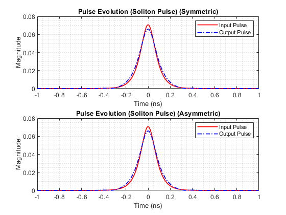

# Solving Nonlinear Schrödinger Equation (NLSE) using Split-Step Fourier Method (SSFM)

## Overview

This repository contains an implementation of the Split-Step Fourier Method (SSFM) to solve the Nonlinear Schrödinger Equation (NLSE) and analyze the behavior of different input signal types in optical fibers. The NLSE is a fundamental equation in nonlinear optics and has applications in various fields.

The main goal of this project is to implement the SSFM algorithm and apply it to two different types of input signals, observing their evolution over a specific distance and time interval. The results will be visualized and discussed to gain insights into the behavior of the signals under the influence of nonlinear effects.

## Problem Description

In this exercise, we consider the NLSE given by:

∂u/∂z + α^2u - iγ|u|^2u = 0

We aim to solve this equation using the SSFM for the following two types of input signals:

1. Soliton Pulse: u(0, t) = √P0 * sech(t / T0)
2. Gaussian Pulse without Chirp: u(0, t) = √P0 * exp(- (1 + iC) / (2 * T0^2) * t^2)

The parameters used for the simulations are:
- β2 = -21.6 ps^2/km
- γ = 1.2 1/km
- P0 = 5 mW
- T0 = |β2| / (γ * P0)
## Results

After running the SSFM solver for both types of input signals, the output waveforms will be generated and saved as images. You can find these images in the `publish/` directory.

### Soliton Pulse

### Gaussian Pulse without Chirp

## License

This project is licensed under the MIT License. See the [LICENSE](LICENSE) file for details.
